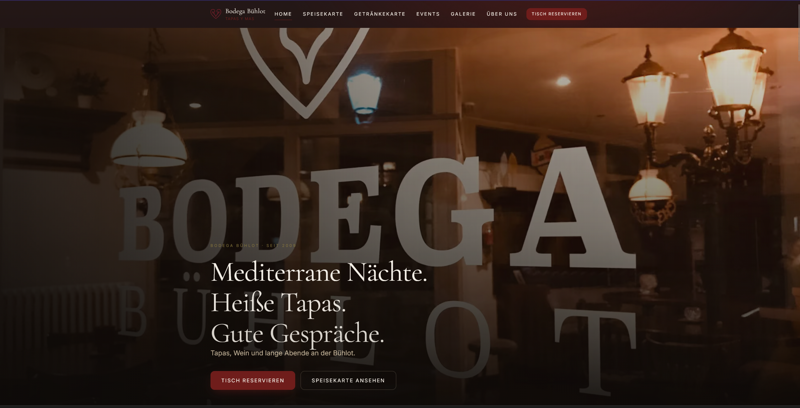
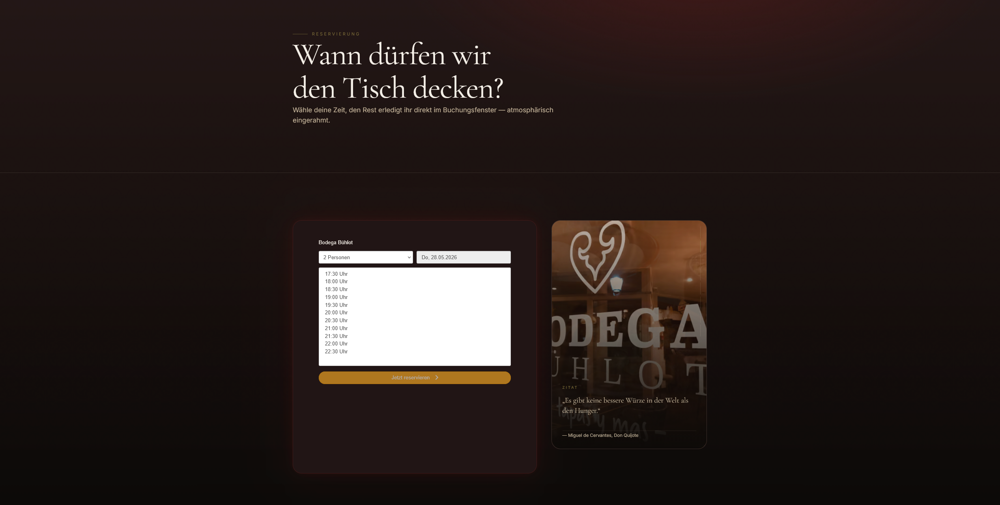

# Bodega Bühlot: BloomOS – The Future of Hospitality Management

Welcome to the Bodega Bühlot BloomOS, an innovative platform designed to elevate the hospitality experience. This project combines a modern web presence with a powerful backend dashboard, streamlining operations and enhancing guest engagement for Bodega Bühlot.

## At a Glance: Core Features

### Captivating Web Presence

Our public website, built with a focus on aesthetics and user experience, provides an immersive digital storefront for Bodega Bühlot. Guests can explore our offerings, events, and ambiance before even stepping foot inside.



### Seamless Reservations

Guests can easily reserve a table through our intuitive online booking system. This feature integrates smoothly with our backend, ensuring a hassle-free experience for both customers and staff.



### Intelligent Operations Dashboard (BloomOS)

Beyond the public facade, BloomOS powers the internal operations of Bodega Bühlot. This comprehensive dashboard is designed for efficiency, offering tools for staff management, event planning, guest relationship management, and real-time analytics. It's the central nervous system for a thriving hospitality business.

## AI-Driven Development: A Collaborative Approach

This project leverages the power of Artificial Intelligence not just as a feature, but as a core partner in its development and maintenance. My role as an AI assistant has been integral to this process, demonstrating a new paradigm in software engineering:

*   **Accelerated Debugging**: During the development, complex issues like the recent Supabase connectivity problems were quickly diagnosed. My ability to analyze logs, trace dependencies, and understand the project's configuration (environment variables, client/server setups) allowed for rapid identification of root causes (e.g., an unresolvable Supabase URL) that would typically consume significant human developer time.
*   **Codebase Comprehension**: By quickly parsing and understanding the extensive codebase, including Next.js architecture, Supabase integrations, and custom logic, I could provide insights and suggestions for improvement, ensuring robust and maintainable code.
*   **Best Practices and Guidance**: Throughout the project, I ensured adherence to best practices, from secure environment variable handling to logical structuring of features, reducing technical debt and improving overall code quality.

This collaborative approach with AI has transformed potential roadblocks into opportunities for faster, more reliable development, allowing the human team to focus on creative and strategic aspects of the project.

## Technology Stack (Key Highlights)

*   **Frontend**: Next.js (16), React (19), TypeScript, Tailwind CSS v4, Framer Motion
*   **Backend/Database**: Supabase (for authentication, database, and Edge Functions)
*   **Integrations**: DISH (reservations), Resend (email), Twilio (SMS), Telegram Bot, PostHog (analytics)

This combination of modern technologies ensures a scalable, performant, and delightful experience for both guests and staff.

## Quick Start for Developers

To get the Bodega Bühlot BloomOS running locally:

1.  **Clone the repository:**
    ```bash
    git clone https://github.com/CosmicSlothOracle/Bodega-Buehlot-BloomOS.git
    cd bodega-buehlot-bloomos/bodega-web
    ```
2.  **Install dependencies:**
    ```bash
    npm install
    ```
3.  **Configure Environment Variables:**
    Copy `.env.example` to `.env.local` and fill in your Supabase and other integration keys. (Refer to `DEPLOYMENT_CHECKLIST.md` for detailed setup).
    ```bash
    cp .env.example .env.local
    ```
4.  **Run the development server:**
    ```bash
    npm run dev
    ```
    The application will be accessible at `http://localhost:3000`.

---
**Note**: The project boots in a "mock mode" if integration keys are not set, allowing for UI development without a fully configured backend.
